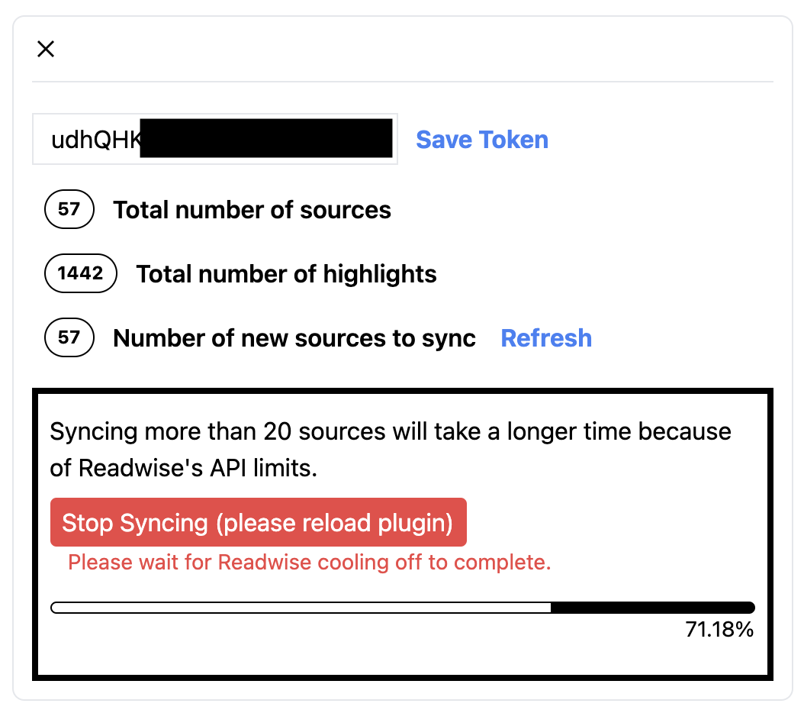

# logseq-readwise-plugin

  

> An unofficial Readwise plugin that pulls all your highlights from Readwise into Logseq. Each book, article, tweet, or podcast becomes its own page tagged `#Readwise` with structured properties — with incremental syncs that only fetch what changed since your last sync.

---

## ✨ Features

- **Full library sync:** pulls every source (books, articles, tweets, podcasts, etc.) from the [Readwise Export API](https://readwise.io/api_deets), paginating through your entire library.
- **Incremental syncs:** after the first sync, only sources updated since your last sync are fetched. The sync timestamp is stored as a block on the `Readwise` page in your graph, so it travels with your graph sync.
- **One page per source:** each source becomes a page tagged `#Readwise`, with its highlights appended as blocks. Each highlight links back to its `Location` in Readwise.
- **Structured properties:** pages carry Readwise metadata as proper Logseq DB properties — `rw-id`, `rw-author`, `rw-readable-title`, `rw-category`, `rw-source`, `rw-cover-image`, `rw-unique-url`, `rw-readwise-url`, `rw-source-url`, `rw-external-id`, `rw-asin`, `rw-document-note`, and `rw-summary`. Authors are stored as node references, so `rw-author` links to author pages.
- **Idempotent:** re-running a sync never duplicates highlights — existing blocks are detected and skipped, and existing pages are matched by their Readwise ID (`rw-id`), not by title.
- **Inline tags become links:** `#tags` inside a highlight are converted to `[[page links]]`.
- **Progress UI:** a progress bar shows fetching and per-book sync progress, with per-book error reporting and the ability to cancel mid-sync or retry after a failure.
- **Rate-limit aware:** Readwise API calls automatically back off and retry on `429` responses, honouring the `Retry-After` header.

### Requirements

- **Logseq DB graphs.** The plugin uses the DB version's tag and property APIs (tag classes, typed properties, node references) and will not work on file-based graphs.
- A [Readwise](https://readwise.io) account and access token.

## 📸 Screenshots / Demo

## ⚙️ Installation

1. Open Logseq.
2. Go to the **Marketplace** (Plugins > Marketplace).
3. Search for **logseq-readwise**.
4. Click **Install**.

## 🛠 Usage

### First-time setup

1. Get your token from the [Readwise Access Token](https://readwise.io/access_token) page.
2. In Logseq, go to `Settings > Plugin Settings > logseq-readwise-plugin` and paste the token into **Readwise API Token**.
3. Click the plugin's toolbar button (the `R` icon) to open the sync panel.
4. Click **Setup Properties**. This creates the `#Readwise` tag and all `rw-*` properties in your graph, and registers them as tag properties so every synced page gets a consistent schema. This only needs to be done once per graph.
5. Click **Start Sync**. The first sync pulls your entire library, so it may take a while if you have thousands of highlights — the progress bar keeps you informed, and you can cancel at any time.

### Subsequent syncs

1. Click the toolbar button (`R` icon).
2. Click **Start Sync**. Only sources updated since your last sync are fetched. New sources get new pages; new highlights on existing sources are appended to their existing pages.

### Commands

Available from the command palette (`Mod+Shift+P`):

- **Readwise: Setup properties** — (re)creates the `#Readwise` tag and the `rw-*` property schema. Run this if the sync panel reports missing setup items.
- **Readwise: Reset sync timestamp** — removes the `Last synced` block(s) from the `Readwise` page, so the next sync pulls your full library again. Useful for starting afresh.

### How syncing works

- The plugin finds existing pages by querying for pages tagged `#Readwise` with a matching `rw-id` property, so you can rename a synced page and new highlights will still land in the right place.
- Within a page, highlights are deduplicated by their content, so already-imported highlights are skipped on every sync.
- Edits you make to highlights in Readwise are **not** propagated to Logseq (and vice versa) — only new highlights are appended.
- You can freely add your own notes as child blocks under any highlight; the plugin only ever appends new top-level blocks.

### Starting afresh

1. Run **Readwise: Reset sync timestamp** from the command palette.
2. Delete the pages the plugin created (pages tagged `#Readwise`), if you want them recreated cleanly.
3. Run a sync — the full library is pulled again. Thanks to deduplication, leaving existing pages in place is also safe; highlights will not be duplicated.

### Settings

`Logseq Settings > Plugin Settings > logseq-readwise-plugin`:

- **Readwise API Token** — your Readwise access token, from [readwise.io/access_token](https://readwise.io/access_token).
- **Properties Configured** — internal flag managed by the plugin; do not edit manually.

## ☕️ Support

If you enjoy this plugin, please consider supporting the development.

  &nbsp;

## 🤝 Contributing

Issues are welcome. If you find a bug, please open an issue. Pull requests are not accepted at the moment as I am not able to commit to reviewing them in a timely fashion.
